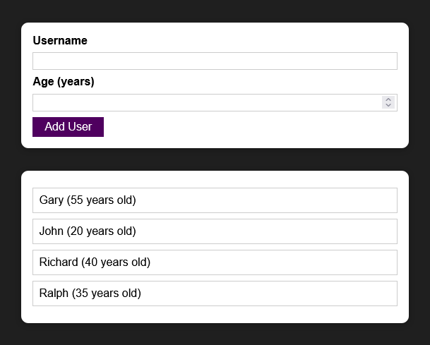
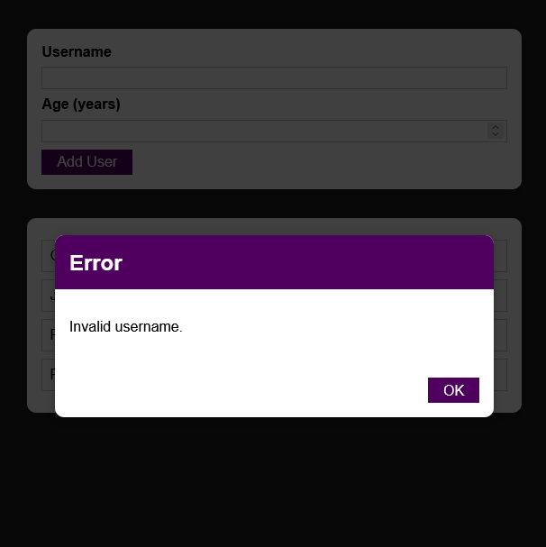

# Guest List 

This is a small project in React that implements a simple Guest Listing.

It's the result of the Section 8 from the Max Schwarzmüller Udemy React Course.

## How it's organized

There's only one branch, called `main` and no tags.

## How to use

Just checkout the code, then install all required dependencies (this will create a `node_modules` folder) and finally run it.

`git clone https://github.com/rdaraujo/react-max-udemy-time-to-practice.git`

`cd react-max-udemy-time-to-practice`

`npm install`

`npm start`

Then open `http://localhost:3000/`.

